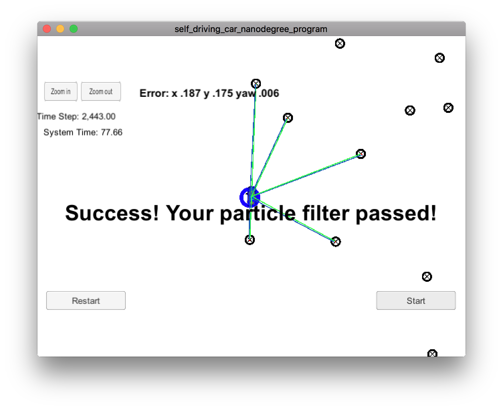

# Overview

Self-Driving Car Engineer Nanodegree Program

This project implements a Particle Filter to estimate the location of a moving vehicle of interest with noisy sensor measurements.

## Project Introduction

The vehicle has been kidnapped and transported to a new location! Luckily it has a map of this location, a (noisy) GPS estimate of its initial location, and lots of (noisy) sensor and control data.

This project implements a 2 dimensional particle filter in C++. The particle filter is given a map and some initial localization information (analogous to what a GPS would provide). At each time step the filter also gets observation and control data. 

This project involves the Term 2 Simulator which can be downloaded [here](https://github.com/udacity/self-driving-car-sim/releases)

# Implementation Overview

The file [particle_filter.cpp](src/particle_filter.cpp) contains the implementation of a `ParticleFilter` class and some associated methods.

Function `ParticleFilter::init` (lines 18-45) sets initial values of `x`, `y` and `theta` for each particle. Values are set in the vicinity of a GPS estimate passed as parameters with gaussian distribution noise specified by standard deviation passed in the `std` parameter. Initial particle weight is set to 1, particle id is set to a 0-based index in the `particles` vector. `std::normal_distribution` is used to generate random noise data. 

Function `ParticleFilter::prediction` (lines 47-83) performs prediction step of the filter. When yaw rate is close to zero, the function updates only `x` and `y` coordinates (lines 68-71), otherwise it updates `x`, `y` and `theta` (lines 60-65). After adding measurements to each particle the function adds gaussian noise (lines 75-82), using `std::normal_distribution`.

Function `ParticleFilter::dataAssociation` (lines 85-100) finds the closest landmark for each observation and sets landmark id in the observation field `id`. It uses `std::min_element` and provides a custom implementation of `Compare` predicate.

Function `ParticleFilter::updateWeights` (lines 102-188) updates particle weights. It build a list of predicted observations located within `sensor_range` radius from particle location (lines 129-139), converts observations to map coordinates (lines 142-152), invokes `dataAssociation` to associate observations with landmarks (line 155), calls `SetAssociations` to provide data to the simulator for visualization purposes (lines 158-167) and finally computes particle weights (lines 170-186).

Function `ParticleFilter::resample` (lines 190-209) resamples particles proportional to their weights, using `std::discrete_distribution`. New resampled list of particles replaces the old list.

## Filter accuracy and runtime performance

The particle filter is able to successfully locate the vehicle with a very limited number of particles. Setting the number of particles to 2 (file [main.cpp](src/main.cpp), line 13) allows the filter to pass the grading code with errors 0.283 for `x` coordinate, 0.272 for `y` coordinate and 0.009 for yaw and runtime of 78.42 seconds (as measured on a MacBook Pro late 2013). 

Setting the number of particles to 20 allows the filter to locate the vehicle with a lower error: 0.165 for `x` coordinate, 0.157 for `y` coordinate and 0.005 for yaw while still keeping run time within 100 seconds limit — 98.44 seconds.

Setting the number of particles to 10 allows to achieve accuracy close to the accuracy of a filter with 20 particles, while reducing the run time to 77.66 seconds, which is close to the run time of the project with 2 particles. The project submission has number of particles set to 10.

1. **Accuracy**: the particle filter localizes vehicle position and yaw with the values of error 0.187 for `x` coordinate, 0.175 for `y` coordinate and 0.006 for yaw.

2. **Performance**: the particle filter completes execution within 77.66 seconds.

